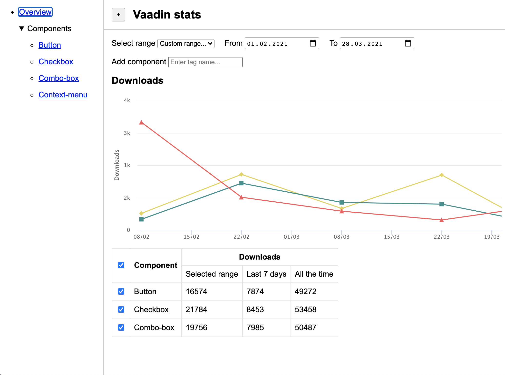
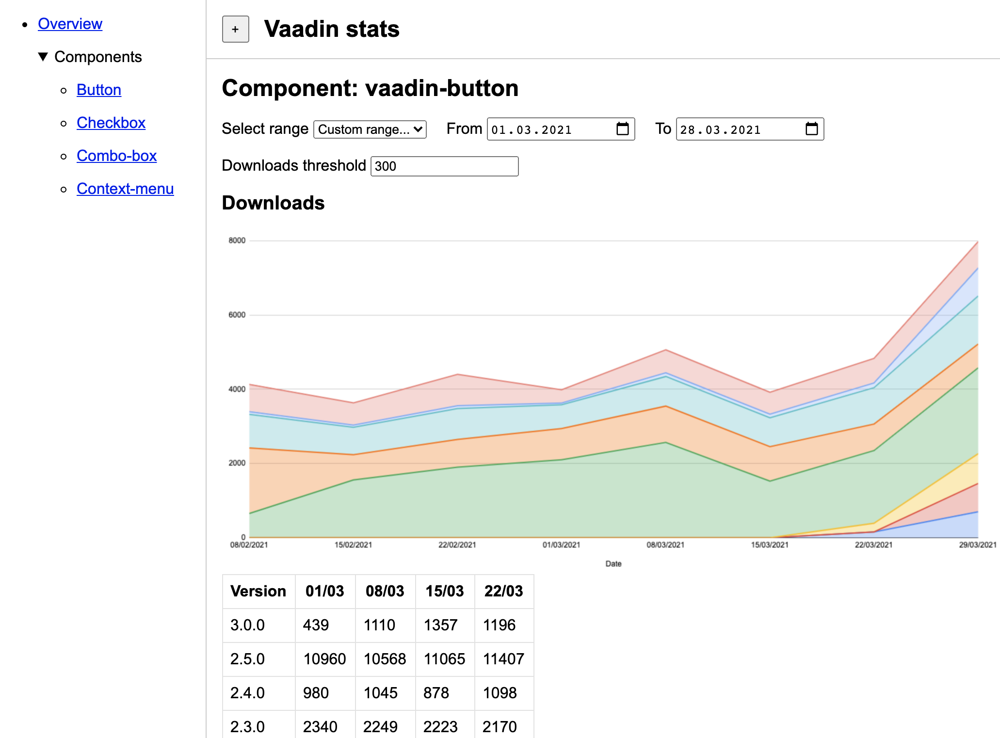

# npm stats learning project

Welcome! It's time for your first project exercise at Vaadin.
The goal of this assignment is to become familiar with some of our projects and tools that we use.

## 1. General

The project is a dashboard to show npm downloads statistics for Vaadin components.
You will need to load the data from JSON endpoints and create some visualization
using Vaadin Design System.

## 2. Project setup

1. Init an application project using [Open Web Components](https://open-wc.org/docs/development/generator/) generator
2. Answer the questions from the CLI prompt to scaffold the app
3. Choose "Yes" for TypeScript, linting, testing, and bundling

## 3. Technical requirements

Please use the following parts of Vaadin to implement the app:

- [Vaadin Design System](https://vaadin.com/docs/latest/ds/overview) as a UI component library
- [Vaadin Router](https://vaadin.com/docs/latest/fusion/routing/router) for navigating between pages

Additionally, you will need to use a set of tools in your app:

- [Web Dev Server](https://modern-web.dev/docs/dev-server/overview/) for local development
- [Web Test Runner](https://modern-web.dev/docs/test-runner/overview/) for writing unit tests
- [ESLint and Prettier](https://open-wc.org/guides/tools/linting-and-formatting/) for linting and formatting
- [Rollup](https://open-wc.org/docs/building/rollup/) to bundle for production

## 4. UI structure

Below you will find a description and screenshots of the UI to give you the overall impression.
You can also find the HTML files in the `mockup` folder.

Please use Vaadin Design System and follow its guidelines to pick the components that you need.

### Layout

All the pages (views) share the same layout, which has following sections:

- Navbar with a title and button to toggle sidebar
- Sidebar with a navigation to switch between views:
  - Overview - should be a link to the default view (marked as active)
  - Components - should be a collapsible section with items for individual components views.
- Content - should contain a view content depending on the navigation.

### Overview page

  
Screenshot

  

The overview page should display the following content:

#### Date range selector

There should be a form with 3 fields:

- select a pre-defined date range (last 2 weeks, last 4 weeks) or a custom range
- select a "from" date as a custom range start
- select a "to" date as a custom range end

Note:

- "From" and "To" fields should be disabled if a pre-defined range is selected.
- It shouldn't be possible to select invalid range (e.g. start date is after end).
- Regardless of chosen day of week, the range should start on that week's Monday.

#### Component selector

There should be a field with autocomplete and a list of suggestions.

- Dropdown items should represent the individual Vaadin components.
- List of components should be the same as in the Sidebar navigation.
- Selecting a component imports the data for it by fetching a JSON API.
- After the data is loaded, the chart and data table are updated (see below).
- After the data for component is updated, the field should be cleared.

There should be a progress indicator visible while data is loaded.

#### Downloads chart

There should be a **line chart** with a series representing individual components.

- Data on the chart should represent downloads over time per component.
- When a new component is added, the chart should be redrawn to show it.

#### Data table

There should be a table with several columns to show the downloads.

- First column should contain the checkboxes to toggle row selection.
- When a new row is added to the table, it should be selected by default.
- Selecting a row makes the corresponding series appear in the chart.
- Unselecting a row removes a corresponding series from the chart.
- Component names in the second column should be links to npm packages.
- Downloads columns should be grouped together as shown in the mockup.

### Component page

  
Screenshot

  

Every component's page should display the following content:

#### Title

The title should contain a component and match the active link in the Sidebar.

#### Progress indicator

There should be a progress indicator visible while component's data is loaded.

#### Date range selector

This component should be identical to the one in the Overview page.

When a new date range is selected, chart and the data table is updated.

#### Threshold field

There should be a field to set a threshold (minimum count of downloads).

- The field should only accept correct values (numbers > 0)
- Typing a value updates the chart and data table (see below).
- There should be a default value set on the field, e.g. 100.

#### Downloads chart

There should be a **stacking area chart** with a series representing individual versions.

- Data on the chart should represent downloads over time per component version.
- The chart should only include npm versions with downloads above threshold.

#### Data table

There should be a table with several columns to show the downloads per version.

- First column should contain the npm versions of the component.
- Other columns should contain downloads per week (e.g. 1/03, 8/03).
- The table should only show versions with downloads above threshold.
- Typing a new threshold should update the table (add / remove rows).
- Choosing a version range should update the table (add / remove columns).
- It should be possible to sort table by each column, including version.

## 5. Implementation

### JSON API

You will need the following API to implement the application:

1. List of components can be obtained from the Platform repository:

https://raw.githubusercontent.com/vaadin/platform/master/versions.json

2. Individual components stats can be obtained from the following files:

https://github.com/web-padawan/npm-downloads/tree/master/docs

Example: https://web-padawan.github.io/npm-downloads/vaadin-accordion.json

### Routes

Please use Vaadin Router and create routes based on the app structure.
Every route should have a corresponding link from the sidebar.

### State

Please make sure your app has some basic state management:

- Version range should be the same for Overview and Component pages
- Downloads data should be cached and reused by Overview and Components views

### Tests

#### Unit tests

Please write unit tests at least for the following components:

1. Date range selector
2. Component chart and data table

#### Visual tests

Please write visual regression tests for several components.

Use Web Test Runner and SauceLabs (ask your mentor to provide you access credentials).

### Deploy

Build your app for production and deploy to a free hosting e.g. Netlify.
